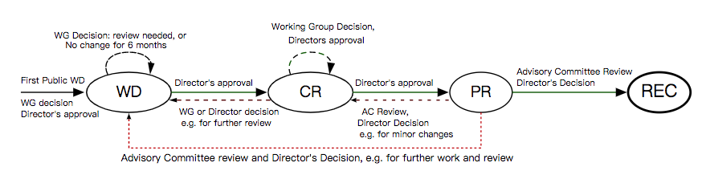

# W3C 规范的运作机制

**详解 W3C 是如何工作的**

-----

## 规范的成熟级别
一个规范从提出到成熟的过程如下图。

各阶段含义如下:

1. **Working Draft(WD)** 草案由 W3C 发布,给 W3C 成员,社区和其他工作组织或机构进行审阅。这份公开文稿并不代表一个技术规范,只是一个建议。
2. **Candidate Recommendation(CR)** 经过大量的评审,符合工作组的技术要求,规范即将进入此阶段的典型标志如下:
	* 经过社区大范围评审,W3C 工作组进行最终评审时
	* 收集到了不同客户代理的实践经验,没有很大的技术问题时
	* 和其他的 W3C 专利方案不冲突时
		> 注意进入专利审查阶段的草案称为 `Last Call Working Draft`,结束此步骤就会到达 CR 阶段
3. **Proposed Recommendation** 当 W3C 董事确认规范质量后,并通过顾问委员会的评审。
	> 注意顾问委员会也可将草案状态重新变到其他阶段
4. **W3C Recommendation(REC)** W3C 委员会将草案进行专利授权后达到此阶段.
此外规范会在发布后有一系列变更常见的版本如下。
	* **An Edited Recommendation** 对文档的文本修订版本
	* **An Amended Recommendation** 对文档的规范的功能修订版本,可以理解为 minor 版本
	* **An Superseded Recommendation** 对文档的规范的功能修改和增加,可以理解为 patch 版本
	* **An Obsolete Recommendation** 建议废除的版本

## 参考资料
* [ ] <https://www.w3.org/2019/Process-20190301/> 