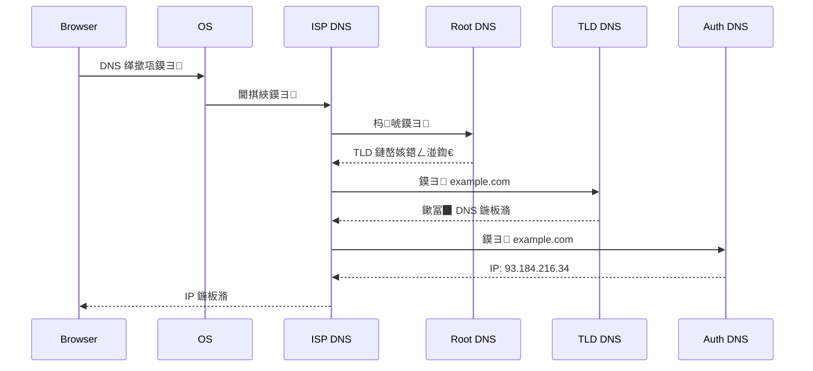

# 涓囩淮缃戝伐浣滄祦绋嬭瑙?
## 姒傝堪

涓囩淮缃戯紙World Wide Web锛夋槸鍩轰簬 HTTP 鍗忚杩愯鐨勫垎甯冨紡瓒呭獟浣撶郴缁熴€備粠鐢ㄦ埛鍦ㄦ祻瑙堝櫒杈撳叆 URL 鍒伴〉闈㈡覆鏌撳畬鎴愶紝缁忓巻浜嗕竴绯诲垪澶嶆潅鐨勭綉缁滈€氫俊鍜屾祻瑙堝櫒娓叉煋杩囩▼銆?
## URL 鍒伴〉闈㈢殑瀹屾暣閾捐矾

```
鐢ㄦ埛杈撳叆 URL 鈫?DNS 瑙ｆ瀽 鈫?TCP 杩炴帴 鈫?HTTP 璇锋眰/鍝嶅簲 鈫?娴忚鍣ㄦ覆鏌?```

### 1. URL 瑙ｆ瀽

鐢ㄦ埛杈撳叆 URL 鍚庯紝娴忚鍣ㄩ鍏堣В鏋?URL 鍚勯儴鍒嗭細

```
https://example.com:8080/path?query=value#section
鈹?     鈹?        鈹?     鈹?     鈹?        鈹?鈹?     鈹?        鈹?     鈹?     鈹?        鈹斺攢鈹€ Fragment (瀹㈡埛绔?
鈹?     鈹?        鈹?     鈹?     鈹斺攢鈹€鈹€鈹€鈹€鈹€鈹€鈹€鈹€鈹€ Query String
鈹?     鈹?        鈹?     鈹斺攢鈹€鈹€鈹€鈹€鈹€鈹€鈹€鈹€鈹€鈹€鈹€鈹€鈹€鈹€鈹€鈹€ Path
鈹?     鈹?        鈹斺攢鈹€鈹€鈹€鈹€鈹€鈹€鈹€鈹€鈹€鈹€鈹€鈹€鈹€鈹€鈹€鈹€鈹€鈹€鈹€鈹€鈹€鈹€鈹€ Port
鈹?     鈹斺攢鈹€鈹€鈹€鈹€鈹€鈹€鈹€鈹€鈹€鈹€鈹€鈹€鈹€鈹€鈹€鈹€鈹€鈹€鈹€鈹€鈹€鈹€鈹€鈹€鈹€鈹€鈹€鈹€鈹€鈹€鈹€鈹€ Hostname
鈹斺攢鈹€鈹€鈹€鈹€鈹€鈹€鈹€鈹€鈹€鈹€鈹€鈹€鈹€鈹€鈹€鈹€鈹€鈹€鈹€鈹€鈹€鈹€鈹€鈹€鈹€鈹€鈹€鈹€鈹€鈹€鈹€鈹€鈹€鈹€鈹€鈹€鈹€鈹€鈹€ Protocol
```

### 2. DNS 瑙ｆ瀽

灏嗗煙鍚嶈В鏋愪负 IP 鍦板潃锛?
1. **娴忚鍣ㄧ紦瀛?* - 妫€鏌ユ祻瑙堝櫒 DNS 缂撳瓨
2. **绯荤粺缂撳瓨** - 妫€鏌ユ搷浣滅郴缁?DNS 缂撳瓨
3. **ISP DNS 缂撳瓨** - 妫€鏌?ISP DNS 鏈嶅姟鍣?4. **閫掑綊鏌ヨ** - ISP DNS 鏈嶅姟鍣ㄥ悜鏍瑰煙鍚嶆湇鍔″櫒鏌ヨ
5. **杩唬鏌ヨ** - 鏍?鈫?TLD 鈫?鏉冨▉ DNS 鏈嶅姟鍣?


### 3. TCP 杩炴帴寤虹珛

浣跨敤涓夋鎻℃墜寤虹珛杩炴帴锛?
```
Client                    Server
  鈹?                        鈹?  鈹傗攢鈹€鈹€鈹€ SYN (seq=x) 鈹€鈹€鈹€鈹€鈹€鈹€>鈹? SYN_SENT
  鈹?                        鈹?  鈹?鈹€鈹€ SYN-ACK (seq=y,ack=x+1) 鈹€鈹€鈹? SYN_RCVD
  鈹?                        鈹?  鈹傗攢鈹€鈹€鈹€ ACK (ack=y+1) 鈹€鈹€鈹€鈹€鈹€>鈹? ESTABLISHED
  鈹?                        鈹?```

**HTTPS 棰濆姝ラ**锛氬湪 TCP 涔嬪悗杩橀渶瑕?TLS/SSL 鎻℃墜锛?
```
Client                    Server
  鈹?                        鈹?  鈹傗攢鈹€鈹€鈹€ ClientHello 鈹€鈹€鈹€鈹€鈹€鈹€>鈹?  鈹?                        鈹?  鈹?鈹€鈹€ ServerHello 鈹€鈹€鈹€鈹€鈹€鈹€鈹€鈹€鈹?  鈹?鈹€鈹€ Certificate 鈹€鈹€鈹€鈹€鈹€鈹€鈹€鈹€鈹€鈹?  鈹?鈹€鈹€ ServerHelloDone 鈹€鈹€鈹€鈹€鈹€鈹?  鈹?                        鈹?  鈹傗攢鈹€鈹€鈹€ Key Exchange 鈹€鈹€鈹€鈹€鈹€鈹€>鈹?  鈹傗攢鈹€鈹€鈹€ ChangeCipherSpec 鈹€鈹€>鈹?  鈹傗攢鈹€鈹€鈹€ Finished 鈹€鈹€鈹€鈹€鈹€鈹€鈹€鈹€鈹€鈹€>鈹?  鈹?                        鈹?  鈹?鈹€鈹€ ChangeCipherSpec 鈹€鈹€鈹€鈹€鈹?  鈹?鈹€鈹€ Finished 鈹€鈹€鈹€鈹€鈹€鈹€鈹€鈹€鈹€鈹€鈹€鈹€鈹?```

### 4. HTTP 璇锋眰/鍝嶅簲

**璇锋眰鏍煎紡**锛?
```
GET /path HTTP/1.1
Host: example.com
User-Agent: Mozilla/5.0
Accept: text/html
Accept-Language: zh-CN
```

**鍝嶅簲鏍煎紡**锛?
```
HTTP/1.1 200 OK
Content-Type: text/html; charset=utf-8
Content-Length: 1234
Cache-Control: max-age=3600

<!DOCTYPE html>
<html>...
```

### 5. 娴忚鍣ㄦ覆鏌撴祦绋?
```
HTML 鈫?DOM Tree
  鈹?  鈹溾攢鈹€ <link> CSS 鈫?CSSOM Tree
  鈹?  鈹斺攢鈹€ <script> 鈫?JavaScript 鎵ц
                      鈹?                      鈻?            DOM Tree + CSSOM Tree
                      鈹?                      鈻?               Render Tree
                      鈹?          鈹屸攢鈹€鈹€鈹€鈹€鈹€鈹€鈹€鈹€鈹€鈹粹攢鈹€鈹€鈹€鈹€鈹€鈹€鈹€鈹€鈹€鈹?          鈻?                     鈻?       Layout                 Paint
    (璁＄畻浣嶇疆)              (缁樺埗鍍忕礌)
```

**璇︾粏姝ラ**锛?
1. **HTML Parsing** - 瑙ｆ瀽 HTML 鏋勫缓 DOM 鏍?2. **CSS Parsing** - 瑙ｆ瀽 CSS 鏋勫缓 CSSOM 鏍?3. **JavaScript Execution** - 鎵ц JS锛堝彲鑳戒慨鏀?DOM/CSSOM锛?4. **Render Tree Construction** - 鍚堝苟 DOM 鍜?CSSOM
5. **Layout** - 璁＄畻姣忎釜鑺傜偣鐨勫嚑浣曚俊鎭?6. **Paint** - 灏嗚妭鐐圭粯鍒跺埌灞忓箷
7. **Composite** - 鍚堟垚鍥惧眰

## W3C 鏍囧噯鎴愮啛搴?
W3C 鏍囧噯浠庢彁妗堝埌姝ｅ紡鎺ㄨ崘缁忓巻澶氫釜闃舵锛?
### 鎴愮啛搴︾瓑绾?
| 闃舵 | 鍚嶇О | 璇存槑 |
|-----|------|-----|
| 1 | Submission | 鎻愪氦锛堟垚鍛樼粍缁囩殑澶囧繕褰曪級|
| 2 | Note | 绗旇锛堢ぞ鍖鸿褰曪紝闈炴爣鍑嗭級|
| 3 | Working Draft (WD) | 宸ヤ綔鑽夋锛堝伐浣滅粍鍐呴儴锛墊
| 4 | Candidate Recommendation (CR) | 鍊欓€夋帹鑽愶紙鍏紑璇勫锛墊
| 5 | Proposed Recommendation (PR) | 寤鸿鎺ㄨ崘锛堟渶鍚庤瘎瀹★級|
| 6 | Recommendation (REC) | 姝ｅ紡鎺ㄨ崘锛堝畼鏂规爣鍑嗭級|

### 杩囨浮鏉′欢

```
Submission 鈫?Note
  鈹斺攢 鏃犳寮忚姹傦紝绀惧尯璁板綍

Note 鈫?Working Draft
  鈹斺攢 宸ヤ綔缁勬垚绔嬶紝寮€濮嬭捣鑽?
Working Draft 鈫?Candidate Recommendation
  鈹斺攢 鍔熻兘瀹屾暣锛屽疄鐜颁簰鎿嶄綔娴嬭瘯

Candidate Recommendation 鈫?Proposed Recommendation
  鈹斺攢 鑷冲皯涓や釜鐙珛瀹炵幇閫氳繃娴嬭瘯

Proposed Recommendation 鈫?Recommendation
  鈹斺攢 W3C 姝ｅ紡鎶曠エ閫氳繃
```

## 娴忚鍣ㄦ覆鏌撲紭鍖?
### 鍏抽敭娓叉煋璺緞

```
棣栧瓧鑺?鈫?DOM 瀹屾垚 鈫?CSSOM 瀹屾垚 鈫?Render Tree 鈫?Layout 鈫?Paint 鈫?鏄剧ず
```

**浼樺寲绛栫暐**锛?
1. **鍑忓皯 DOM 娣卞害** - 绠€鍖?DOM 缁撴瀯
2. **浼樺寲 CSS** - 閬垮厤澶嶆潅閫夋嫨鍣?3. **寮傛鍔犺浇 JS** - 浣跨敤 `async`/`defer`
4. **鍏抽敭 CSS 鍐呰仈** - 棣栧睆 CSS 鍐呰仈
5. **璧勬簮棰勫姞杞?* - `<link rel="preload">`

### 閲嶆帓锛圧eflow锛夊拰閲嶇粯锛圧epaint锛?
| 绫诲瀷 | 瑙﹀彂鏉′欢 | 鎬ц兘褰卞搷 |
|-----|---------|---------|
| 閲嶆帓 | 鍏冪礌鍑犱綍灞炴€у彉鍖?| 楂?|
| 閲嶇粯 | 澶栬鍙樺寲浣嗗嚑浣曚笉鍙?| 涓?|

**閬垮厤閲嶆帓**锛?
```javascript
// 鉂?澶氭閲嶆帓
element.style.left = '10px';
element.style.top = '20px';

// 鉁?鍚堝苟淇敼
element.style.transform = 'translate(10px, 20px)';

// 鉁?浣跨敤 CSS 绫?element.classList.add('moved');
```

## 鍙傝€冭祫鏂?
- [W3C Process Document](https://www.w3.org/2005/10/Process-20051014/tr)
- [MDN - How the web works](https://developer.mozilla.org/en-US/docs/Learn/Getting_started_with_the_web/How_the_Web_works)
- [WHATWG HTML Living Standard](https://html.spec.whatwg.org/)
- [Web Performance Working Group](https://www.w3.org/webperf/)
