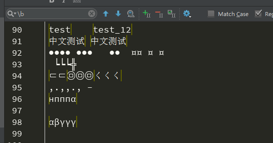
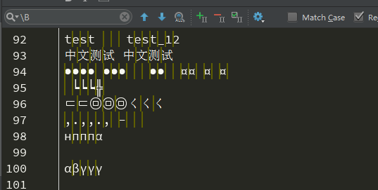

# regexp

**详解 js 正则语法**

-----

## 概述
js 中正则定义分为两部分   `<pattern><flags>`  

1. `pattern` 正则模式,js 支持的正则语法集
2. `flags` 设定正则的查询模式

采用如下方式实例化正则对象:

1. 字面量模式定义
   
	```js
	//斜杠内为正则模式，后面为正则配置项
	var  reg = /test/g; //斜杠内为正则的匹配模式,后面为配置模式
	```

2. 使用构造函数创建
   
	```js
	var reg = new Regexp(/\w/,"g") // 引号内为正则规则
	var reg1 = new RegExp('\\w','g'); // 注意这里需要经过两次转义才对
	```

	> 采用字符串创建, `\` 需转义!!!


## 基本概念
详细的正则语法参见 [MDN 正则表](https://developer.mozilla.org/zh-CN/docs/Web/JavaScript/Guide/Regular_Expressions#%E7%BC%96%E5%86%99%E4%B8%80%E4%B8%AA%E6%AD%A3%E5%88%99%E8%A1%A8%E8%BE%BE%E5%BC%8F%E7%9A%84%E6%A8%A1%E5%BC%8F) 

> 注意中文版 MDN 正则列举并不完全,可以查看英文版

这里归类如下:

* `零宽断言` 用于位置匹配,由于匹配的是位置不占据字符宽度所以称为零宽断言
  * `(?=pattern)` 先行断言(lookahead),该位置之后的内容符合匹配模式
  * `(?!pattern)` 先行否定断言(negative lookahead),该位置之后的内容不符合匹配模式
  * `(?<=pattern)` 后行断言(lookbehind),该位置之前的内容符合匹配模式
  * `(?<!pattern)` 后行否定断言(negative lookbehind),该位置之前的内容不符合匹配模式
  * `^` 匹配开头,多行模式匹配行开头
  * `$` 匹配结尾,多行模式匹配行结尾
  * `\b` 匹配单词的边界,只要该位置前后不同时出现两个`\w`对应的字符则属于字符边界
  * `\B` 为 `\b` 条件取反
* `组合` 用于限定模式分组
  * `[]` 匹配符合范围内的单个字符 
  * `[^]` 上述操作取反
  * `(pattern)` 捕获匹配分组,符合括号内的模式可以被引用 
  * `(?<name>pattern)` 具名捕获匹配分组,符合括号内的模式可以内具名引用 
  * `(?:pattern)` 非捕获匹配分组,匹配该模式但是无法被引用
  * `pattern|pattern1` 或逻辑,匹配之前或之后的模式 
  * `\n` 指代 `(pattern)` 匹配的模式
* `数量` 用于限定模式匹配次数
  * `pattern*` 匹配模式 0 到 ∞ 次
  * `pattern+` 匹配模式 1 到 ∞ 次
  * `pattern?` 匹配模式 0 到 1 次
  * `pattern{m,n}` 匹配模式 m 到 n 次
  * `pattern{m,}` 匹配模式 m 到 ∞ 次
  * `pattern{m}` 匹配模式 m次
  * `pattern*?` 非贪婪匹配模式,支持在上述所有数量限定后添加 `?`
* `字符集` 匹配特定条件的字符
  * `.` 匹配出换行符外其他字符
  * `\d` 匹配数字[0-9] 
  * `\D` 匹配非数字 
  * `\w` 匹配[a-zA-Z0-9_]
  * `\w` 匹配非 `\w`
  * `\s` 匹配空白符
  * `\S` 匹配非空白符
  * `\t` 匹配垂直制表符
  * `\r` 匹配回车符
  * `\n` 匹配换行符
  * `\v` 匹配垂直制表符 
  * `\f` 匹配表单符号
  * `[\b]` 匹配退格符号
  * `\0` 匹配 null 字符
  * `\cX` 控制字符+字符组合
  * `\xhh` 匹配单个字符,值等于 hh,常用语匹配 ascii 控制字符
  * `\uhhhh` 匹配 UTF-16 字符
  * `\u{hhhh},\u{hhhhh}` 匹配超过 UTF-16 字符集
  * `\` 匹配注意字符

### 正则模式

| 标志位 | 含义                                                                                  |
| :----- | :------------------------------------------------------------------------------------ |
| g      | 表示全局匹配                                                                          |
| i      | 表示匹配是不区分大小写                                                                |
| s      | 允许 `.` 匹配 newline字符                                                             |
| u      | 匹配 unicode 字符集                                                                   |
| m      | 多行匹配模式，对于`^` 和 `$` 以换行或回车符表示起始和结束，而不是整个文本的开始和结束 |
| y      | 表示从指定的位置开始匹配字符串，而不进行循环匹配                                      |


这里高频和常用语法进行讲解,日常使用可以结合 [regexr](https://regexr.com/) 验证各种正则示例

### 零宽断言
正则是字符模式和定位模式的匹配。
典型的定位模式包含如下种类:

* `^` 开头
* '\b,\B' 单词和非单词边界
* '$' 结尾
* '(?=pattern)' 符合匹配模式之前的位置
* '(?!pattern)' 不符合匹配模式之前的位置
* '(?<=pattern)' 符合匹配模式之后的位置
* '(?<!pattern)' 不符合匹配模式之后的位置

> 注意由于位置不占据空间所以 `/^test/` 和 `/^^^test/` 概念相同
> 注意无法采用 `^*test` 的模式限定位置

在正则零宽断言不匹配任何内容
   

通过对不同符号类型进行的测试可知，`\b` 非连续的 [a-zA-Z0-9_]的字符位置。
> 注意特殊字符的的位置并没有 \b 标识

对于`\B`结果相反
   


### 匹配组 ()
`(pattern)` 作为捕获分组,该结果会被存储,捕获模式下有如下引用

* `\n` 在匹配时指代匹配到的组
  * n 大于 9 指代,数字第一位
  * 不存在时表示匹配字符串
  * 书序按照括号顺序从左往右数
  * 分组存在数量则使用最后一次匹配结果
* `$n` 在替换时指代匹配的内容

举例如下:

* `(w)\1` 由于字符 w 被圆括号括起来，所以可以利用 `\1` 来引用括号内的结果，该模式表示匹配两个 w 的字符，类似于 `w{2}` 
* `(w(w))\1\2` 首先匹配组是按照，从左至右的顺序确定的，所以，最外层括号对应 `\1` 内层对应 `\2`.由于 `\1` 匹配外层表示 `w{2}` `\1` 表示 `w{1}`,则该匹配等价于 `w{5}`,注意若不想保存某个匹配分组，采用`(?:)` 的形式，比如`(w(?:w))\1\2`,此时 `\2` 的匹配分组不存在等效为 `w{4}\2`

一个误区是认为 `\n` 指代捕获分组的模式索引,**实际上指代的是捕获分组的结果**,参看下例

```js
//该模式会查找到 af:af 的字符串
/(([0-9a-f]{2}):)\1/g.exec('af:af:23:45'); 
```

<!-- TODO: 完善此处示例说明 -->


### 字符集 [] 
在方括号当中使用圆括号，不会产生对应正向预查、匹配组等功能。而是会当做单独字符处理。
所有特殊字符在字符集中都当做对应字符处理没有特殊意义。可以利用`-`来表示一个字符范围。注意该模式匹配的是一个字符，若要匹配多个字符需要结合次数符号。

* `[w(?=w)]` 由于字符集只匹配字符，所以改正则并没有正向预查功能，只表示匹配 w、(、?、=、）这几个字符的意思
* `[w*2]` 道理同上，相当于匹配 w、*、2 
* `[ab]{2}`由于字符集只能匹配单一字符，所以要匹配两个字符，后面要加数量匹配符，该正则表示匹配 aa、ab、bb 均可，

## Regexp 构造器
* 属性
  * `RegExp.$1-9` 当使用 `String.prototype.match` 或 `String.prototype.replace` 成功时,该值表示捕获匹配对应组的内容,默认为空


## Regexp.prototype 原型
原型对象属性和方法如下:

* 属性
  * `RegExp.prototype.flags` 保存标志位配置信息,只读
  * `RegExp.prototype.dotAll` 设置`.dotAll` 是否匹配所有字符,对应正则配置项中的 s,只读
		> 为什么采用 s,猜测是应为正则 \s 表示空白的含义
  * `RegExp.prototype.global` 对应正则配置项中的 g,只读
  * `RegExp.prototype.ignoreCase` 对应 i,只读
  * `RegExp.prototype.multiline`,对应 m,只读
  * `RegExp.prototype.source` 对应 u,只读
  * `Regexp.prototype.sticky` 对应粘滞模式
  * `RegExp.prototype.lastIndex` 改值表示起始的搜寻位置可写，注意改值在某些情况下的差异[lastindex](https://developer.mozilla.org/en-US/docs/Web/JavaScript/Reference/Global_Objects/RegExp/lastIndex)
* 方法
  * `exec` 利用正则在字符串中查找匹配数组
  * `test` 测试字符串中是否有符合条件的正则模式
  * `toString` 返回该正则的字面量模式定义

### 重点方法讲解
### RegExp.prototype.exec(str)
查找符合正则模式的字符串,返回首次匹配的结果,示例如下

```js
# 忽略大小写全局匹配
var re = /quick\s(brown).+?(jumps)/ig;
var result = re.exec('The Quick Brown Fox Jumps Over The Lazy Dog');
```
初始化的正则对象 re 包含如下属性:
* `re.ignoreCase`	是否使用了'i'标记使正则匹配忽略大小写, true
* `re.global`	是否使用了'g'标记来进行全局的匹配, true
* `re.multiline`	是否使用了'm'标记使正则工作在多行模式（也就是，^ 和 $ 可以匹配字符串中每一行的开始和结束（行是由 \n 或 \r 分割的），而不只是整个输入字符串的最开始和最末尾处。）, false
* `re.source`	正则模式的字符串	quick\s(brown).+?(jumps)


返回值为一个数组对象

* `result[0]` 表示匹配的整个结果  `[0]->Quick Brown Fox Jumps`
* `result[1],...[n]` 表示`()` 捕获分组的匹配结果从左到右, `[1]->Brown [2]->Jumps`
* `result.index` 表示首次匹配到的字符串基于原始字符的索引位置 `index->4`
* `result.input` 表示原始字符， `input = 'The Quick Brown Fox Jumps Over The Lazy Dog'`

经过上面的函数后，正则对象`re`的属性发生了如下变化

* `re.lastIndex` 下一次匹配的开始位置, 25


> 重点是理解正则是字符和位置的匹配,在进行替换时
> 要考虑替换时内容替换还是位置替换!!!


## 例题
* [16 进制匹配]
* [密码匹配],数字,小写字母,大写字母组成,至少包含两种字符

## 工具介绍
* 显示 regexp 状态图 <https://regexper.com/#a%7B2%2C3%7D%28ab%29%7B2%2C3%7D>
* 显示 regexp 工作流程 <https://regex101.com/>
## 参考资料
* [MDN 正则表达式](https://developer.mozilla.org/en-US/docs/Web/JavaScript/Guide/Regular_Expressions#Advanced_searching_with_flags)
* [MDN RegExp](https://developer.mozilla.org/en-US/docs/Web/JavaScript/Reference/Global_Objects/RegExp)
* [js 正则迷你书](https://github.com/qdlaoyao/js-regex-mini-book)


